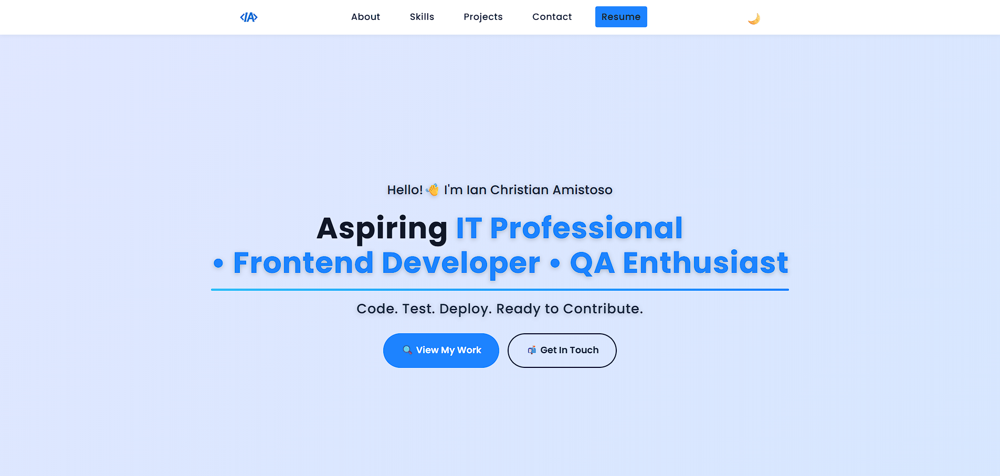
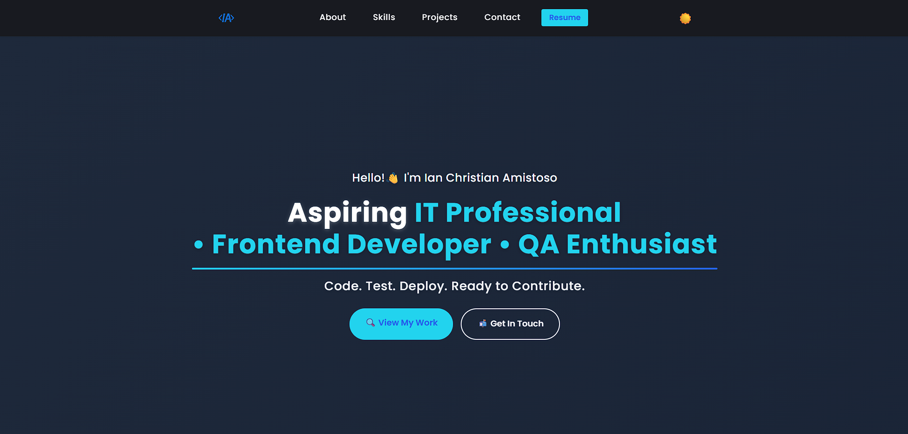
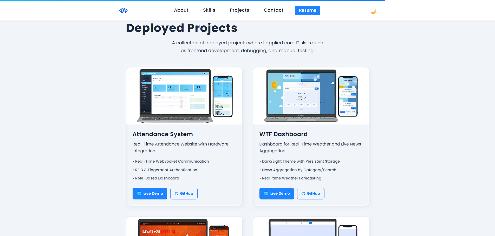
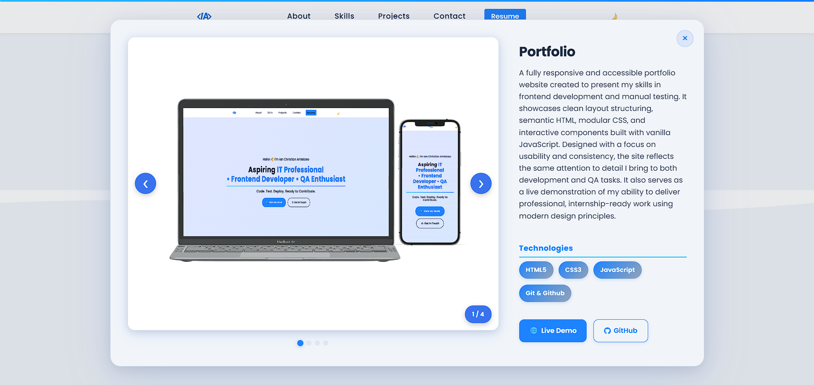

## **TL;DR**: A modern, responsive, and accessible portfolio site showcasing my frontend development and QA skills.

  

&nbsp;

# 🌐 Ian Christian Amistoso - Developer Portfolio

This is the personal portfolio website of **Ian Christian Amistoso**, an aspiring **Frontend Developer** and **QA Tester** based in Cainta, Rizal, Philippines. The site presents a showcase of solo-built projects, technical skills, and learning milestones—all in a clean, responsive, and accessible design.

📍 **Live Site**: [https://ian-amistoso-portfolio.netlify.app](https://ian-amistoso-portfolio.netlify.app)
🛠️ **Tech Stack**: HTML5, CSS3, JavaScript (ES6)  
🚀 **Deployment**: Netlify (Static), Awardspace (Dynamic)
🎯 **Focus**: Frontend development, responsive-layout, accessibility, UI/UX principles

---

## 🔑 Key Features

- 💼 **Project Showcase**: Modal previews, carousel galleries, live demo links, and tech stacks  
- 🌓 **Dark Mode Toggle**: Light/dark theme switch with animation  
- 📱 **Responsive Design**: Mobile-first approach for full device coverage  
- ✨ **Scroll Animations**: Section fade-ins and hover effects  
- 🧩 **SVG Dividers**: Smooth visual transitions between page sections  
- 📊 **Skills Visualization**: UI representation of tools and tech stack proficiency  
- 🧑‍🎓 **Currently Learning**: Highlights ongoing studies (e.g., React)

---

## 💼 **Project Showcase**

### 🖼️ Screenshots

### 📌 Homepage  

### 📌 Homepage Dark Mode

### 📌 Projects Section

### 📌 Projects Modal

---

📚 Full Project Documentation

## 🎨 Design & UX Highlights

- **Mobile-First Layout**: Optimized for all screen sizes  
- **Glassmorphism Cards**: Modern visual style with blur and shadows  
- **Keyboard Accessible Navigation**: Enables full site navigation via Tab, Shift+Tab, and Enter keys  
- **Color Contrast & ARIA Tags**: Improved accessibility standards  
- **Semantic HTML**: Organized tags with meaningful structure  

---

## ✅ QA Approach

- Manual exploratory testing on each section and interaction  
- Responsive layout testing using Chrome DevTools  
- Animation and transition consistency testing  
- Tested live links, scroll behaviors, and modal components  
- Verified accessibility features by navigating without a mouse  

---

## 🛠️ Built With

- **HTML5** – Semantic layout and accessible structure  
- **CSS3** – Modular styling, Grid, and Flexbox  
- **JavaScript (Vanilla)** – DOM manipulation and animations  
- **Netlify** – Hosting and continuous deployment

---

## 🧠 Currently Learning

- **React.js** – Component-based architecture and state management  

---

## 🎯 Purpose

This site serves as a **central hub** for employers and collaborators to explore my projects, assess my skillset, and contact me for **internship or freelance roles** in web development, software QA and general IT.

---

## 📬 Contact

📧 Email: `ianamistoso27@gmail.com`  
📱 Phone: `+63 915 226 4832`  
🌍 Location: Cainta, Rizal, Philippines  
🔗 GitHub: [https://github.com/notZuri](https://github.com/notZuri)

---

## 📌 Status

**🟢 Live & Actively Maintained** — I regularly update this portfolio to reflect new skills, completed projects, and UI improvements.

